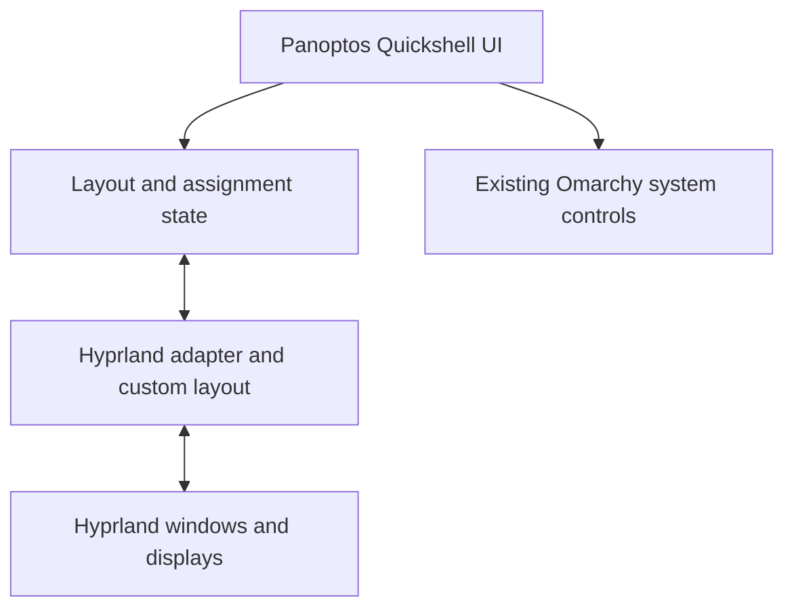

# Panoptos Linux specification

Status: proposed initial specification; implementation has not started.
Updated: 2026-10-04.

## 1. Product and audience

Panoptos is an Omarchy-based Linux desktop with a more approachable interface and
the persistent zone model established by [Panoptos for macOS](https://github.com/RUverse/panoptos-mac).
The first release serves Mac and Windows users who are new to Linux. Everyday
desktop tasks must be discoverable with the mouse, with keyboard shortcuts
available alongside visible controls.

The project edits and extends the Omarchy codebase. Omarchy remains the system
foundation: its installation, packages, hardware integration, and update process
are reused. Panoptos owns its shell components, window behavior, graphical
configuration, and saved desktop state.

The first delivery is a desktop layer that can be installed on a supported
Omarchy system. A branded installation image follows once that layer is stable.

## 2. Scope and inherited support

| Area | Responsibility |
| --- | --- |
| Kernel, GPU drivers, hardware-specific fixes | Inherit the selected Omarchy base and its packages |
| Suspend/resume, networking, audio, Bluetooth, peripherals | Reuse existing integration; verify that Panoptos changes cooperate with it |
| Monitor scaling, connection events, screen-sharing portals | Reuse existing capabilities; adapt Panoptos surfaces and layouts to their state |
| Installation, system updates, snapshots, recovery | Retain upstream mechanisms and expose useful entry points in the UI |
| Shell appearance, navigation, settings, onboarding | Implement the Panoptos interface |
| Persistent zones, stacks, assignment rules, switchers | Implement Panoptos behavior through the compositor and shell |
| Panoptos configuration and compatibility | Version, migrate, and test the project-owned state |

Inherited support means retaining upstream functionality, not promising that
every hardware combination has been tested by Panoptos. Initial compatibility
claims must name the Omarchy/package versions and machines actually tested.

Release 1 includes nested zone layouts, one active window per zone, mixed-app
stacks, mouse and keyboard switching, assignment persistence, and graphical
controls for the desktop's common settings.

Later features include paired applications inside one zone, universal application
menu replication, detailed window previews, and application/document session
restoration. Native Apple Silicon support is a separate platform decision.
Release 1 targets supported x86_64 Omarchy systems and does not add a new hardware
port or custom driver stack.

## 3. User journeys

1. A new user finishes a short tour, opens applications from a visible launcher,
   chooses a layout preset, and assigns windows without learning a shortcut.
2. A user creates three zones on a wide display, puts several applications in
   each, and switches them without changing the neighboring zones.
3. A laptop user disconnects a display and keeps every open window reachable;
   reconnecting restores the saved layout for that display setup.
4. A user changes scaling or layout, sees the result, and can recover through
   an obvious revert action.
5. A user restarts the Panoptos shell and retains layout and assignment state
   without closing applications.

## 4. Window-management contract

### Layouts

- A layout is a tree of left/right or top/bottom splits with adjustable ratios.
  Leaves are persistent zones with stable identifiers.
- Geometry is stored relative to the usable monitor area, excluding global
  shell reservations. Zone switchers occupy space reserved inside their zone.
- Empty zones remain present. Opening, closing, or switching a window does not
  resize unrelated zones.
- The editor provides presets, split, merge, divider dragging, undo, cancel,
  and explicit save. Temporary edits do not overwrite the saved layout.
- A merge retains every assignment from the removed zone. A split keeps existing
  windows in one resulting zone until the user moves them.
- Invalid splits or sizes are rejected with an explanation. If a later display
  change makes a window impossible to fit, that window becomes floating and
  remains reachable; its preferred assignment is retained.

### Assignment and stacks

- A zone can contain windows from different applications. Exactly one member is
  visible in that zone during normal stacked operation.
- Switching members preserves zone geometry and keyboard focus on the selected
  window. Inactive members must not unexpectedly cover another zone or enter the
  ordinary window cycle as visible duplicates.
- The switcher shows application icons and enough titles to distinguish multiple
  windows. Closing a member activates another member; closing the last leaves an
  empty zone.
- Every window has visible move-to-zone and detach actions. Detached windows can
  be moved and resized normally.
- The preferred direct gesture is a modifier-assisted drag with highlighted
  destinations. The precise modifier and event handling are decided after the
  feasibility prototype. The visible move action remains available.
- For a newly opened normal window, an explicit remembered application rule for
  the current workspace takes priority. Without a rule, the window remains
  floating and can be assigned by the user. Assigning one window does not silently
  create a rule for all windows of that application.
- Dialogs, popups, utility windows, and windows that cannot fit stay floating.
  A dialog must remain associated with its parent and usable.
- Fullscreen temporarily covers the relevant display without changing the saved
  zone tree; leaving fullscreen restores normal placement.

### Workspaces and displays

- A saved layout belongs to a display profile. Normal workspaces share its
  geometry, while zone membership and active members are workspace-specific.
- Assignment rules apply to the current workspace in release 1. Switching a
  workspace must not pull windows from other workspaces.
- Upstream special workspaces remain outside the Panoptos zone model.
- Display profiles use stable display metadata where available, with a defined
  fallback for indistinguishable displays. Connector names alone are insufficient.
- Display disconnection moves affected windows to a visible workspace on an
  available display, using floating placement when necessary. It preserves the
  previous display profile and intended assignments for reconnection.
- Layouts and switchers account for logical coordinates, scaling, rotation, and
  reserved areas. Monitor event handling is deterministic and repeatable.

### Persistence

- Save layout trees, zone identifiers, display profiles, memberships, stack
  ordering, application rules, shortcuts, appearance, and onboarding completion.
- Store configuration and state in Panoptos-owned XDG directories. Use a schema
  version, atomic writes, and a recoverable last-known-good copy.
- Compositor addresses and process IDs are session handles, not durable identity.
  Restore live matches first and use application identity plus window metadata
  conservatively after restarts. Ambiguous matches remain unassigned.
- Restore layouts and eligible running-window assignments after a shell restart
  or login. Restoring closed applications and their documents is outside release 1.
- A corrupted state file produces a usable default and a recovery message. It must
  not delete the corrupt file or close applications.

## 5. Desktop interface

Provide a visible launcher and dock/taskbar, a control center, a window/zone
switcher, a settings application, and an optional replayable welcome tour.
Their visual system shares typography, spacing, icons, focus indicators, and
light/dark appearance. Final visual styling is developed during the UI prototype.

The launcher supports search and browsing. Common actions have labels or tooltips;
unfamiliar icons are not the only way to identify an action. Menus display available
shortcuts, and shortcuts can be edited without typing configuration syntax.

Common settings cover layouts, displays and scaling, appearance, shortcuts,
networking, audio, Bluetooth, and power behavior. Existing services and reliable
upstream controls are reused. Less common configuration can retain an advanced
entry point. Graphical controls validate values, report failures, and preserve
unrelated user configuration.

Display mode, arrangement, and scaling changes provide a timed confirmation and
automatic revert to the previous usable configuration. A layout change provides
preview and undo. System updates have a visible entry point into the inherited
Omarchy workflow; a separate package updater is not introduced.

Panoptos surfaces support keyboard navigation, visible focus, adjustable text,
sufficient contrast, and reduced motion. Screen-reader behavior must be tested;
accessibility support is documented from actual results.

## 6. Proposed technical approach

Use Quickshell/QML for shell surfaces and settings. Prefer project-owned plugins
and small upstream integration edits so that updates remain reviewable.

Use a Hyprland custom layout for persistent placement, with native grouping where
it satisfies the stack contract. Upstream documentation currently describes Lua
custom layouts, but availability and behavior in the selected Omarchy package
must be proven before adopting that design. A C++ plugin is a fallback requiring
an explicit compatibility and maintenance assessment, not an assumed dependency.

Keep the layout/state model separate from QML views and compositor operations.
Start with the simplest implementation that meets the contract. Introduce a
separate service only if the prototype shows a lifecycle or performance need.

Import Omarchy at a recorded release/commit and retain source provenance. Keep
project-owned configuration distinct from upstream defaults. Compatibility
records must include actual package versions; an ISO tag alone does not identify
every package on an updated installation.

## 7. Release acceptance

| ID | Required observable result |
| --- | --- |
| A1 | A newcomer opens an app, selects a preset, assigns a window, switches a stack, and opens settings through visible controls |
| A2 | Three persistent zones retain their geometry through window open, close, assign, detach, and switch operations |
| A3 | Mixed-app stacks switch correctly with mouse and keyboard; titles distinguish multiple windows of one app |
| A4 | Shell restart restores layout and eligible live assignments without closing applications |
| A5 | Display disconnect/reconnect leaves all windows reachable and restores the matching profile |
| A6 | Popups, dialogs, fullscreen transitions, and workspace changes preserve usable focus and placement |
| A7 | Invalid display changes automatically revert; invalid/corrupt state has a recoverable fallback |
| A8 | Panoptos surfaces work at tested integer/fractional scales and with keyboard navigation and reduced motion |
| A9 | Screen sharing, locking, and suspend/resume continue working on the same machines where the unmodified base passes |
| A10 | Install, update, disable, and uninstall preserve unrelated settings and provide access to the upstream desktop |

Release evidence records machines, package versions, applications, failures, and
known limitations. Source review is not a substitute for these runtime checks.

## 8. Decisions still to validate

- Selected Omarchy/package baseline and available Lua layout/event APIs.
- Native group behavior, hidden-member semantics, and overlay space reservation.
- Reliable modifier-drag feedback and input handling under Wayland.
- Display identity fallback and conservative assignment restoration.
- Final visual styling, default preset, and default shortcuts.
- Accessibility behavior and the first tested hardware matrix.
- Licensing and notices for the Linux additions before redistribution; preserve
  upstream notices and the terms of any reused macOS source.

## 9. Research references

Initial research used Omarchy v4.0.4; it is a reference baseline, not a claim that
the proposed Linux implementation has been validated. Upstream documentation can
describe APIs newer than packages included in a release.

- [Omarchy v4.0.4](https://github.com/omacom/omarchy/releases/tag/v4.0.4)
- [Shell plugin architecture at v4.0.4](https://github.com/omacom/omarchy/blob/v4.0.4/docs/omarchy-shell.md)
- [Hardware setup at v4.0.4](https://github.com/omacom/omarchy/blob/v4.0.4/install/hardware/all.sh)
- [Monitor configuration](https://omarchy.org/manual/monitors/)
- [Updates, migrations, and snapshots](https://omarchy.org/manual/updates/)
- [Hyprland custom Lua layouts](https://wiki.hypr.land/configuring/layouts/custom-layouts/)
- [Quickshell Hyprland integration](https://quickshell.org/docs/v0.2.1/types/Quickshell.Hyprland/Hyprland/)
- [Qt menu export](https://doc.qt.io/qt-6/qmenubar.html): menu replication depends on application support.

The implementation sequence and estimates are in [PLAN.md](PLAN.md).
